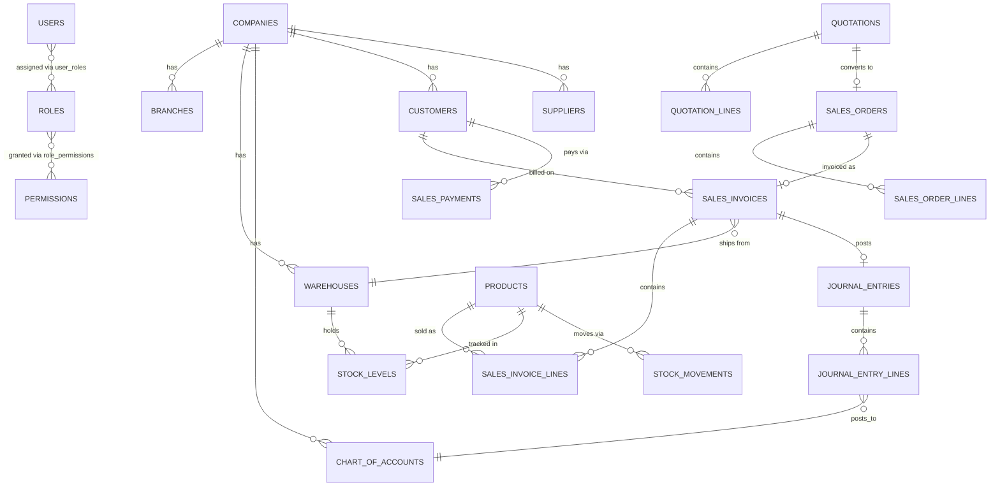

# Database

PostgreSQL, accessed exclusively through TypeORM entities under `backend/src/modules/*/entities`
and `backend/src/entities`. Entities are the schema's source of truth for this build — see the
note on migrations below.

## Conventions

- Every table has a UUID primary key (`id`), `createdAt`/`updatedAt` timestamps, and a soft-delete
  `deletedAt` column (via `BaseEntity` in `entities/base.entity.ts`).
- All monetary columns are `NUMERIC(18,4)`; percentages are `NUMERIC(7,4)`.
- Multi-tenancy columns (`companyId`, `branchId`) are plain UUID columns with a `ManyToOne`
  relation, not partitioning — fine at this scale, revisit if a deployment needs strict row-level
  isolation between companies.
- Foreign keys use `RESTRICT` for references that must never dangle (e.g. a stock movement's
  product), and `SET NULL`/`CASCADE` where orphaning is acceptable (e.g. deleting a branch nulls
  out `warehouse.branchId` rather than blocking).

## Schema migrations in this build

Generating an accurate `migration:generate` diff requires TypeORM to introspect a **live**
Postgres instance, which wasn't available while building this in a sandboxed environment. Instead:

- `npm run schema:sync` (backend) creates the entire schema directly from the entities
  (`DataSource.synchronize()`), used by `docker-compose up` on first run.
- Once you have a running Postgres instance, run `npm run migration:generate -- InitialSchema`
  to snapshot a proper timestamped migration, then switch `docker-compose.yml`'s backend command
  from `schema:sync` to `migration:run` for subsequent deployments. `synchronize` should never run
  against a database with real data.

## Table groups

| Group | Tables | Notes |
|---|---|---|
| Security / RBAC | `users`, `roles`, `permissions`, `role_permissions`, `user_roles`, `sessions`, `audit_logs` | `permissions.module` + `permissions.action` forms the `module.action` code checked by `PermissionsGuard` |
| Org / Settings | `companies`, `branches`, `warehouses`, `currencies`, `exchange_rates`, `taxes`, `fiscal_years`, `numbering_series`, `product_categories`, `brands`, `units` | `numbering_series` issues sequential document numbers per company/document type |
| Parties | `customers`, `suppliers`, `sales_representatives` | |
| Inventory | `products`, `product_batches`, `stock_levels`, `stock_movements`, `stock_adjustments` (+lines), `stock_transfers` (+lines) | `stock_levels` holds the current weighted-average cost per product/warehouse; `stock_movements` is the append-only ledger |
| GL / Accounting | `chart_of_accounts`, `journal_entries`, `journal_entry_lines`, `cost_centers`, `projects`, `budgets` | `journal_entries` are immutable once posted — corrections are reversing entries (see `JournalPostingService.reverse`) |
| Sales | `quotations` (+lines), `sales_orders` (+lines), `delivery_notes`, `sales_invoices` (+lines), `sales_returns` (+lines), `sales_payments` | `sales_invoices.journalEntryId` links to the GL entry it generated |
| Purchasing *(scaffold)* | `purchase_requests` (+lines), `purchase_orders` (+lines), `goods_receipts`, `purchase_invoices` (+lines), `purchase_payments`, `supplier_returns` | Schema complete; no posting/workflow logic yet |
| Treasury *(scaffold)* | `cash_boxes`, `bank_accounts`, `cash_transactions`, `transfers` | Master data CRUD only; not yet wired to payments |

## Well-known Chart of Accounts codes

To keep the GL posting logic simple and auditable, several modules post against a fixed set of
account codes (seeded by `database/seeds/run-seed.ts`, defined in
`modules/accounting/default-account-codes.ts`):

| Code | Account |
|---|---|
| 1010 | Cash on Hand |
| 1020 | Bank Accounts |
| 1100 | Accounts Receivable |
| 1200 | Inventory |
| 2100 | Accounts Payable |
| 2200 | Tax Payable |
| 3000 | Owner's Equity |
| 3100 | Retained Earnings |
| 4000 | Sales Revenue |
| 4100 | Sales Returns & Allowances |
| 5000 | Cost of Goods Sold |
| 5900 | Inventory Adjustment Expense |
| 6000 | Operating Expenses |

A future pass could replace this fixed convention with a per-company configurable
account-mapping table (e.g. "which account is Accounts Receivable for company X") — reasonable for
a foundation build, but not what a multi-company production deployment should rely on long-term.

## ER diagram (core, fully-built modules)

The full schema (~50 tables including scaffolded Purchasing/Treasury) is defined in the entity
files; this diagram covers the fully-functional core to stay readable.
